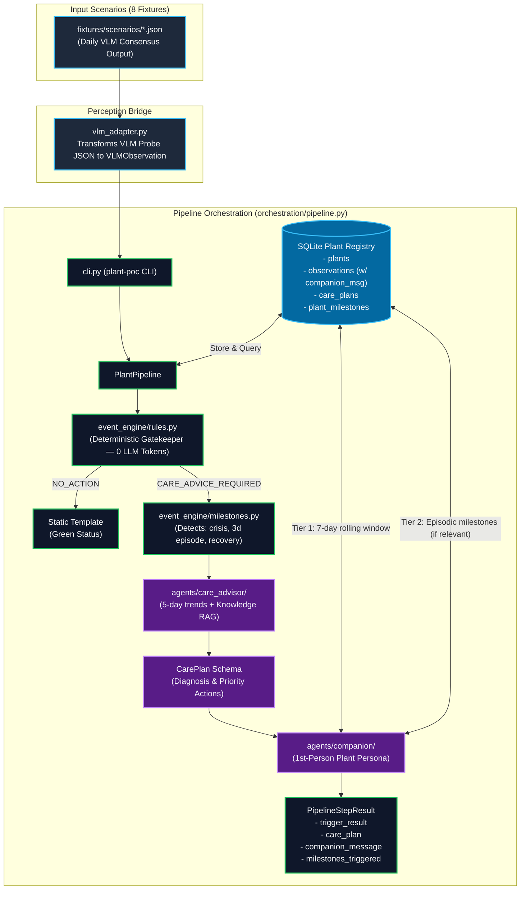

# poc-ai-agent — Post-VLM Plant Care Pipeline

A proof-of-concept multi-agent pipeline that runs **after** an upstream Vision Language Model (VLM) observes a plant photo.
Given an aggregated `PROBE RESULT`, it evaluates deterministic health trigger rules, tracks plant health and life milestones over time, reasons over plant history and care knowledge, and delivers the care plan as a first-person message **spoken by the plant itself** with two-tier memory context.

---

## Architecture



### Component Flow

```text
fixtures/scenarios/*.json   ← mock VLM probe results (input)
         │
         ▼
     vlm_adapter.py         ← transforms 5-run consensus PROBE RESULT into VLMObservation
         │
         ▼
      cli.py                ← entry point (plant-poc CLI)
         │
         ▼
orchestration/pipeline.py   ← wires event engine, milestone detector, care advisor & companion
    │              │
    ▼              ▼
registry/      event_engine/
(SQLite)       ├── rules.py         ← deterministic trigger decisions (zero LLM)
               │   ├── NO_ACTION (steady/healthy)
               │   └── CARE_ADVICE_REQUIRED (health drop/new symptom)
               └── milestones.py    ← detects life events (crisis, 3-day severe episode, recovery)
                         │
               ┌─────────┴──────────┐
               ▼                    ▼
     knowledge/ (RAG)      agents/care_advisor/
     embeddings +          reasons over 5-day history
     cosine search         & botanical knowledge → CarePlan
                                    │
                                    ▼
                          agents/companion/
                          plant speaks as itself (first-person voice)
                          ├── Short-term: 7-day rolling observation context
                          └── Long-term:  episodic milestones (surfaced conditionally)
```

---

## Interface Contracts (VLM & Frontend)

This pipeline sits between the **Upstream Perception (VLM)** model and the **Mobile Client (Flutter App)**.

> [!NOTE]
> **Complete Specification Document:**
> For the complete data dictionary with every field, mandatory/optional status, allowed enums, and data types, refer to:
> **[docs/interface-specification.md](<file:///Users/tinnapatplangsri/Documents/UTS%20semester%203/Industry%20project/codebase/poc-ai-agent/docs/interface-specification.md>)**

### Quick Summary

| Direction | Interface | Format | Key Fields |
| :--- | :--- | :--- | :--- |
| **Input (VLM &rarr; Pipeline)** | Daily `PROBE RESULT` | JSON | `plant_id`, `health_status` (`healthy` \| `possibly_unhealthy` \| `unhealthy`), `confidence`, `consensus` (`agreement`, `runs`), `observations[]` (`type`, `severity`), `image_refs` |
| **Output (Pipeline &rarr; Frontend)** | Delivery Payload | JSON | `day`, `plant_id`, `health_status`, `decision` (`NO_ACTION` \| `CARE_ADVICE_REQUIRED`), `companion_message`, `milestones_triggered[]`, `care_plan` (`assessment`, `actions[]`) |

**Health Status Tiers:**
- 🟢 **`healthy`**: No symptoms (`observations: []`). Emits `NO_ACTION` with cheerful template (0 LLM tokens).
- 🟡 **`possibly_unhealthy`**: Borderline stress (mild drooping, localized crisp tips). Serves as an **early-warning prevention trigger** (`CARE_ADVICE_REQUIRED` on new appearance, amber badge in UI).
- 🔴 **`unhealthy`**: Severe symptoms (chlorosis, wilting, necrosis). Triggers urgent care plan, push alert, and `health_crisis` milestone.

<details>
<summary><b>View Sample Input (VLM PROBE RESULT)</b></summary>

```json
{
  "plant_id": "plant-monstera-1",
  "species": "Monstera deliciosa",
  "timestamp": "2026-09-22T08:30:00Z",
  "health_status": "unhealthy",
  "confidence": 0.91,
  "consensus": { "agreement": 1.0, "runs": 5, "model_stated_average": 0.91 },
  "observations": [
    { "type": "leaf_yellowing", "severity": "severe", "confidence": 0.90 }
  ],
  "image_refs": ["s3://plant-photos/monstera-1/2026-09-22_raw.jpg"]
}
```

</details>

<details>
<summary><b>View Sample Output (Frontend Action Card & Speech Bubble)</b></summary>

```json
{
  "day": 2,
  "plant_id": "plant-monstera-1",
  "timestamp": "2026-09-22T08:30:00Z",
  "health_status": "unhealthy",
  "decision": "CARE_ADVICE_REQUIRED",
  "companion_message": "Hey there! My lower leaves are turning yellow, just like back when we overwatered in March. Could you pause watering for 5 days so my roots can get some oxygen? 🌿",
  "milestones_triggered": [
    { "event_type": "health_crisis", "description": "Health dropped to unhealthy: leaf_yellowing (severe)" }
  ],
  "care_plan": {
    "assessment": "Severe chlorosis indicates root hypoxia from overwatering.",
    "actions": [
      { "priority": 1, "action": "Hold watering for 5 days until the top 2 inches of soil are dry." }
    ]
  }
}
```

</details>

---

## Setup

> Requires Python ≥ 3.12 and [uv](https://github.com/astral-sh/uv) (or plain pip).

```bash
# Install dependencies and the CLI
uv pip install -e .
# or
pip install -e .
```

Copy and configure environment variables:

```bash
cp .env.example .env
```

| Variable                 | Default                     | Description                                |
| ------------------------ | --------------------------- | ------------------------------------------ |
| `OLLAMA_HOST`          | `http://localhost:11434`  | Ollama server URL                          |
| `OLLAMA_MODEL`         | `qwen2.5:latest`          | LLM used by Care Advisor + Companion       |
| `OLLAMA_EMBED_MODEL`   | `nomic-embed-text:latest` | Embedding model for Knowledge RAG          |
| `CONFIDENCE_THRESHOLD` | `0.5`                     | Below this confidence → request more info |
| `DEFAULT_SPECIES`      | `Monstera deliciosa`      | Fallback species when not in observation   |
| `SQLITE_DB_PATH`       | `:memory:`                | DB path (`:memory:` resets each run)     |

### Ollama setup (required for live LLM mode)

```bash
ollama serve                          # start Ollama if not running
ollama pull qwen2.5:latest            # LLM for Care Advisor + Companion
ollama pull nomic-embed-text:latest   # embedding model for Knowledge RAG
```

> **Without Ollama running**, the pipeline can still be run fully offline using the `--mock` flag or offline test suite.

---

## Running Scenarios

```bash
# Run all 8 scenarios back to back (automatically writes docs/scenario-results.log and .json)
plant-poc run-batch --scenario all

# Run all scenarios offline without Ollama:
plant-poc run-batch --scenario all --mock

# Run a specific scenario by name:
plant-poc run-batch --scenario milestone_lifecycle --mock
plant-poc run-batch --scenario health_status_change --log
plant-poc run-batch --scenario severity_increase
plant-poc run-batch --scenario new_symptom
plant-poc run-batch --scenario low_confidence
plant-poc run-batch --scenario improvement
plant-poc run-batch --scenario no_change
plant-poc run-batch --scenario mixed_multiday

# Additional CLI flags:
#   --companion-llm   Use LLM for companion persona projection instead of template
#   --mock            Use mock LLM responses offline (no Ollama required)
#   --log             Write/replace docs/scenario-results.log (default on for 'all')

# List all available scenarios
plant-poc list-scenarios

# Interactive picker (prompts you to choose from list)
plant-poc run-batch
```

### Scenario table

| Scenario                 | What it tests                                                                                                        | Expected trigger                     |
| ------------------------ | -------------------------------------------------------------------------------------------------------------------- | ------------------------------------ |
| `no_change`            | Same health + symptoms every day                                                                                     | `NO_ACTION`                        |
| `new_symptom`          | A new symptom type appears                                                                                           | `CARE_ADVICE_REQUIRED`             |
| `health_status_change` | Health status flips (e.g. healthy → possibly_unhealthy)                                                             | `CARE_ADVICE_REQUIRED`             |
| `severity_increase`    | Same symptom, severity escalates                                                                                     | `CARE_ADVICE_REQUIRED`             |
| `low_confidence`       | Confidence drops below threshold                                                                                     | `REQUEST_MORE_INFORMATION`         |
| `improvement`          | Severity decreases, nothing new                                                                                      | `NO_ACTION`                        |
| `mixed_multiday`       | 5-day sequence covering multiple cases                                                                               | Mixed per day                        |
| `milestone_lifecycle`  | 6-day sequence demonstrating`first_symptom`, `health_crisis`, `severe_episode` (3 days), and `full_recovery` | Mixed per day / Milestones triggered |

---

## Database Architecture (Plant Registry)

The SQLite database implements the unified 4-table model aligned with production PostgreSQL:

1. **`plants`**: Static plant profile (`plant_id`, `species`, `nickname`, `location`, `care_preferences_json`).
2. **`observations`**: Daily time-series health snapshots (`timestamp`, `health_status`, `confidence`, `observations_json`, `leaf_posture`, `leaf_color_detail`, `image_refs_json`, `companion_message`). Stored indefinitely.
3. **`care_plans`**: Prescribed care actions from the Care Advisor (`assessment`, `confidence`, `actions_json`).
4. **`plant_milestones`**: Major episodic life events (`first_symptom`, `health_crisis`, `severe_episode`, `near_death`, `full_recovery`) with timestamps and resolution state.

---

## Running Tests

```bash
# Run all tests (56 tests fully offline in ~4s)
pytest

# Run with verbose output
pytest -v

# Run specific test suites
pytest tests/test_milestones.py -v
pytest tests/test_event_engine.py -v
pytest tests/test_companion.py -v
pytest tests/test_care_advisor.py -v
pytest tests/test_registry.py -v
pytest tests/test_vlm_adapter.py -v
pytest tests/test_pipeline.py -v
pytest tests/test_e2e_scenarios.py -v
```

---

## Project Structure

```text
src/plant_poc/
├── config.py            # env vars + shared constants
├── schemas/             # shared Pydantic models (VLMObservation, CarePlan, PlantMilestone, ...)
├── vlm_adapter.py       # transforms upstream 5-pass consensus PROBE RESULT into VLMObservation
├── registry/            # SQLite store (plants, observations, care_plans, plant_milestones)
├── event_engine/
│   ├── rules.py         # deterministic trigger rules (NO_ACTION, CARE_ADVICE, MORE_INFO)
│   └── milestones.py    # deterministic milestone detection engine (life events & recovery)
├── knowledge/           # RAG: ingest → embed → cosine search
├── llm/                 # Ollama adapter + MockLLMClient interface
├── agents/
│   ├── base.py          # shared tool-calling loop + schema-retry
│   ├── care_advisor/    # LLM agent → produces structured CarePlan
│   └── companion/       # plant speaks as itself with two-tier memory
├── orchestration/
│   └── pipeline.py      # wires event engine → milestones → care advisor → companion
└── cli.py               # plant-poc CLI entry point

fixtures/
├── scenarios/           # 8 test scenario JSON fixtures
└── knowledge/           # markdown plant care guides ingested into RAG

tests/                   # pytest test suite (56 offline-first tests)
docs/
├── production-architecture.md # End-to-end production architecture specification
└── plans/               # Brainstorm designs and work trackers
```
