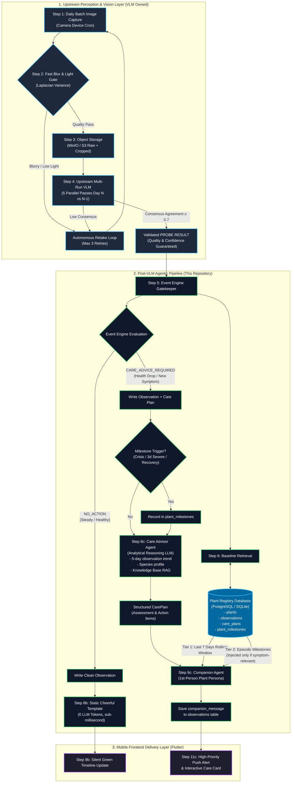
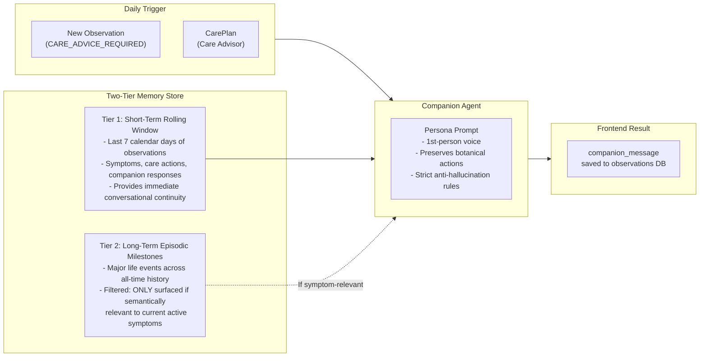

# Final Architecture & Data Flow: Post-VLM Plant Care Pipeline

**Project:** `pet-plant` / Post-VLM Agentic Care Pipeline
**Document:** End-to-End Data Flow & Service Architecture Specification
**Status:** Approved Architecture (v2.0 — Latest)
**Date:** September 2026

---

## 1. Complete End-to-End Visual Data Flow



### Text Flow Diagram

```text
══════════════════════════════ 1. CLIENT & PERCEPTION LAYER (VLM Owned) ══════════════════

     [ Step 1: Batch Image Capture — Daily, Triggered by VLM Pipeline ] ◄────────────┐
                                      │                                               │
                                      ▼                                               │
               [ Step 2: Client-Side Fast Blur/Light Gate ]                           │
               (If quality fails: VLM pipeline automatically retakes — internal loop) │
               (Our post-VLM pipeline NEVER receives a low-quality scan)              │
                                      │ (Quality OK: Upload Image)                    │
                                      ▼                                               │
                  [ Step 3: Object Storage (MinIO / S3) ]                             │
                  - Stores raw photo (original resolution)                            │
                  - Stores thumbnail and cropped plant segment                        │
                                      │                                               │
                                      ▼                                               │
             [ Step 4: Upstream VLM Multi-Run Inference Engine ]                      │
             - Runs 5 parallel vision passes (Day N vs Day N-1)                      │
             - Computes consensus agreement score & confidence                        │
             - If retake needed: loops back to Step 1 automatically ─────────────────┘
             - Emits PROBE RESULT (only on success — quality guaranteed):
               • health_status: "healthy" | "possibly_unhealthy" | "unhealthy"
               • symptoms: [{"type": "...", "severity": "...", "confidence": ...}]
               • leaf_posture & leaf_color_detail
               • agreement score (0.0 - 1.0) — guaranteed > threshold here
                                      │
                                      ▼
══════════════════════════════ 2. POST-VLM PIPELINE ══════════════════════════════════

                                      │
                                      ▼
                   [ Step 5: Event Engine Gatekeeper ]
                                      │
                                      │ [ Step 6: READ Baseline Observation ]
                                      ▼
              [ Plant Registry DB (PostgreSQL / Multi-tenant) ]
              ┌──────────────────────────────────────────────────────────────┐
              │ plants            (profile — written once at setup)          │
              │  plant_id, species, nickname, location, pot_type             │
              ├──────────────────────────────────────────────────────────────┤
              │ observations      (daily log — stored FOREVER, never deleted)│
              │  plant_id, timestamp, health_status, symptoms,               │
              │  confidence, leaf_posture, leaf_color_detail,                │
              │  image_refs, companion_message                               │
              ├──────────────────────────────────────────────────────────────┤
              │ care_plans        (written on CARE_ADVICE_REQUIRED only)     │
              │  plant_id, timestamp, assessment, actions                    │
              ├──────────────────────────────────────────────────────────────┤
              │ plant_milestones  (major life events — stored FOREVER) ★     │
              │  plant_id, timestamp, event_type, description, resolved_at   │
              │  event_types: first_symptom | health_crisis | severe_episode │
              │               near_death | full_recovery                     │
              └──────────────────────────────────────────────────────────────┘
                                      │
                   ┌──────────────────┴──────────────────┐
                   │                                     │
                   ▼                                     ▼
             [ NO_ACTION ]                     [ CARE_ADVICE_REQUIRED ]
         (healthy / unchanged)               (health drop / new symptom)
                   │                                     │
                   │ [ Step 7b: WRITE ]                  │ [ Step 7c: WRITE ]
                   │   clean obs to                      │   observations table
                   │   observations table                │   + care_plans table
                   │                                     │   + plant_milestones
                   │                                     │   (if milestone triggered)
                   │                                     │
                   │                                     ▼
                   │                      [ Step 8c: Care Advisor Agent ]
                   │                      (Analytical Reasoning LLM)
                   │                      ├── Reads observations (5-day trend)
                   │                      ├── Reads plants (species / profile)
                   │                      └── Queries Knowledge RAG (VDB)
                   │                                     │
                   │                                     ▼
                   │                           [ Validated CarePlan ]
                   │                           (assessment, actions)
                   │                                     │
                   │                                     ▼
                   │                        [ Step 9c: Companion Agent ]
                   │                        (Persona LLM / Voice Engine)
                   │                        ├── Preserves CarePlan actions
                   │                        ├── Speaks in 1st-person voice
                   │                        ├── TWO-TIER MEMORY RETRIEVAL:
                   │                        │   • Short-term: observations (last 7 days)
                   │                        │   • Long-term: plant_milestones (all time,
                   │                        │     referenced only if relevant to symptom)
                   │                        └── Output saved to
                   │                            observations.companion_message
                   │                                     │
                   ▼                                     ▼
       [ Step 8b: STATIC TEMPLATE ]               [ Step 10c: LLM VOICE ]
       (0 tokens, < 1ms)                          (Tokens used only here)
       "I'm feeling great!                        "My leaves are drooping like
        Leaves are happy today."                   back in March, could you check
                                                   my soil moisture? 🌿"
                   │                                     │
                   └──────────────────┬──────────────────┘
                                      │
                                      ▼
══════════════════════════════ 3. USER DELIVERY LAYER ════════════════════════════════

                                      │
              ┌───────────────────────┴───────────────────────┐
              │                                               │
              ▼                                               ▼
 [ Step 9b: App Status Update ]             [ Step 11c: Push Alert
   (Steady / Healthy)                         & Care Card Delivery ]
 - Green status in timeline               - High-priority push notification
 - Peaceful check-in message              - Interactive action care cards
 - Zero notification spam                 - Plant speaks in 1st-person voice
                                            incorporating memory context
```

---

## 2. Step-by-Step Execution Sequence

### Phase 1: Client & Perception (VLM Owned)

- **Step 1:** The VLM pipeline triggers a daily batch image capture (not a manual user tap).
- **Step 2:** Fast client-side Laplacian blur/lighting check. If quality fails, the VLM pipeline retakes automatically — no user prompt is shown. Our post-VLM pipeline only ever receives a passing scan.
- **Step 3:** Valid images are uploaded to Object Storage (MinIO / S3).
- **Step 4:** The Upstream VLM runs 5 parallel inference passes (Day N vs Day N-1), computes consensus agreement, and — only after a successful scan — emits the structured `PROBE RESULT`. If retake is needed, it loops back to Step 1 internally.

### Phase 2: Post-VLM Pipeline

- **Step 5:** The Event Engine receives the `PROBE RESULT` as the gatekeeper.
- **Step 6:** Event Engine queries the **Plant Registry DB** for the plant's baseline from the `observations` table, and the plant's static profile from the `plants` table.
- **Deterministic Pipeline Routing:**
  Image quality and consensus are fully guaranteed upstream by the perception gate. The Event Engine evaluates the differential between the new observation and baseline to route directly to one of two operational pathways:
  - **Path B (`NO_ACTION`) — Steady / Healthy:**
    - **Step 7b:** Saves the clean observation to the `observations` table.
    - **Step 8b:** Instantly pulls a static cheerful template (0 tokens, sub-millisecond).
    - **Step 9b:** Updates plant status to green in the app timeline without notifications.
  - **Path C (`CARE_ADVICE_REQUIRED`) — Health Drop / New Symptom:**
    - **Step 7c:** Saves the clean observation to `observations`. Saves prescribed care to `care_plans`. If a milestone threshold is crossed (e.g. first symptom, 3+ consecutive `UNHEALTHY` days), writes an entry to `plant_milestones`.
    - **Step 8c:** Care Advisor Agent reasons over the 5-day `observations` trend, plant species profile, and Knowledge RAG to produce a structured `CarePlan`.
    - **Step 9c:** Companion Agent translates the `CarePlan` into first-person plant voice using **Two-Tier Memory**:
      - **Short-term Memory:** Reads the last 7 days of `observations` to maintain day-to-day conversational continuity.
      - **Long-term Episodic Memory:** Reads `plant_milestones` (all-time), but **only references past crises if semantically relevant** to the current symptom (e.g. recurring yellowing). If unrelated, it stays silent about past milestones.
      - The generated message is saved to `observations.companion_message`.
    - **Step 10c:** Emits the final dialogue message.
    - **Step 11c:** High-priority push notification and interactive care card delivered to the mobile app frontend.

---

## 3. Plant Registry DB: Four Tables

| Table | Purpose | Retention |
|---|---|---|
| `plants` | Static plant profile: species, nickname, location, pot type | Forever (updated only on profile change) |
| `observations` | Daily health snapshots: symptoms, VLM data, `companion_message` | Forever — all records kept |
| `care_plans` | Prescribed care actions per `CARE_ADVICE_REQUIRED` event | Forever — all records kept |
| `plant_milestones` | Major life events: `first_symptom`, `health_crisis`, `severe_episode`, `near_death`, `full_recovery` | Forever — never deleted |

---

## 4. Two-Tier Memory & Milestone Architecture

The Companion Agent uses a two-tier memory architecture to avoid token bloat and hallucinated memory recitations while preserving emotional continuity.



### Deterministic Milestone Triggers
1. **`first_symptom`**: The first time any health issue appears on a previously healthy plant.
2. **`health_crisis`**: Sudden drop to `UNHEALTHY` (e.g., severe fungal spread or root rot symptoms).
3. **`severe_episode`**: A severe condition persisting for **3 or more consecutive days**.
4. **`near_death`**: Persistent critical distress for **7 or more consecutive days**.
5. **`full_recovery`**: Complete transition back to `HEALTHY` with zero symptoms after an episode.

---

## 5. Mobile Delivery Contract

> [!NOTE]
> For the full data dictionary, field-by-field constraints, and VLM/Frontend interface contracts, see **[docs/interface-specification.md](file:///Users/tinnapatplangsri/Documents/UTS%20semester%203/Industry%20project/codebase/poc-ai-agent/docs/interface-specification.md)**.

The output delivered to the Flutter mobile app follows a unified payload:

```json
{
  "plant_id": "monstera_01",
  "timestamp": "2026-09-22T08:00:00Z",
  "trigger_result": "CARE_ADVICE_REQUIRED",
  "milestones_triggered": [
    {
      "event_type": "first_symptom",
      "description": "First symptom observed: leaf_yellowing (moderate)"
    }
  ],
  "care_plan": {
    "diagnosis_ref": "Overwatering induced chlorosis",
    "assessment": "Leaf yellowing indicates root moisture saturation.",
    "immediate_actions": [
      {
        "action": "Hold watering for 5 days",
        "priority": "HIGH",
        "instructions": "Allow top 2 inches of soil to dry out completely."
      }
    ]
  },
  "companion_message": "Hey there! My lower leaf is starting to yellow, just like back when we overwatered. Could you pause watering for a few days so my roots can breathe? 🌿"
}
```

---

## 6. Architecture Evolution & Superseded Concepts (Changelog)

This document represents **v2.0 (Latest)**. The table below records all previous designs that were rendered obsolete:

| Superseded / Obsolete Design | Latest v2.0 Production Design | Architectural Rationale |
| :--- | :--- | :--- |
| **Branch A User Clarification Loop**<br>(Old Step 9a: asking user for more info on low confidence) | **Upstream Hardware/VLM Retake Loop**<br>(Steps 2 & 4: automatic retakes on blur or low consensus) | Moved image quality validation to the edge device. The post-VLM pipeline only receives high-confidence scans; zero user notification friction. |
| **5-Table Schema with Separate `diagnoses`**<br>(Initial draft in `plant-poc-prd.md`) | **4-Table Unified Schema**<br>(`plants`, `observations`, `care_plans`, `plant_milestones`) | `diagnoses` merged into `care_plans`, `companion_message` stored directly on `observations`, and `plant_milestones` dedicated to long-term memory. |
| **Interactive Bi-Directional Chatbot**<br>(Assumed real-time chat sessions) | **Single-Shot 1st-Person Push/Card**<br>(Step 9b / 11c) | Daily autonomous care cards eliminate chat session overhead and better match daily plant growth rates. |
| **Unbounded Raw History for Companion**<br>(Passing entire observation log to LLM) | **Two-Tier Memory System**<br>(7-day rolling window + relevant episodic milestones) | Prevents context window explosion and prevents unprompted recitation of ancient, resolved crises. |
| **LangChain / LangGraph Dependencies** | **Pure Python + Pydantic + SQLite/Postgres** | Minimizes dependency bloat, guarantees sub-second execution, and provides complete deterministic control. |
