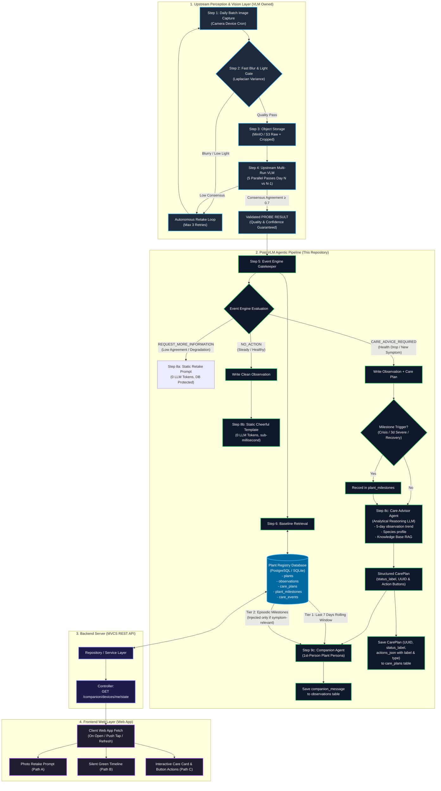
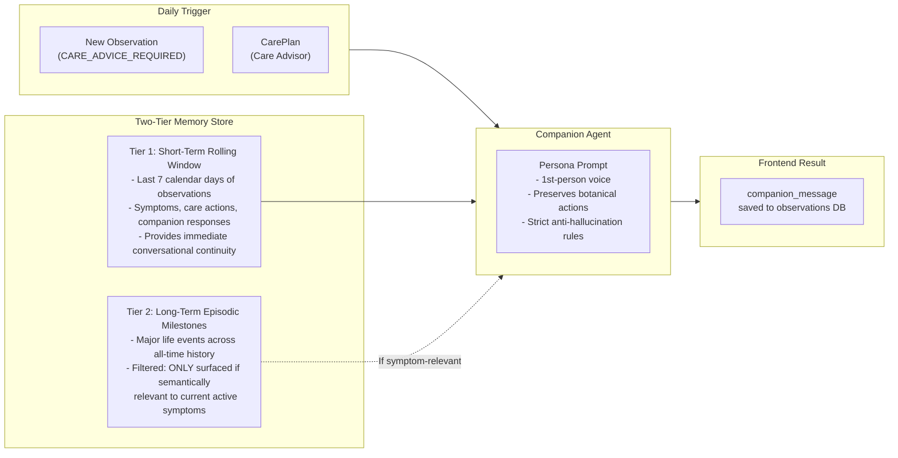

# Final Architecture & Data Flow: Post-VLM Plant Care Pipeline

**Project:** `pet-plant` / Post-VLM Agentic Care Pipeline
**Document:** End-to-End Data Flow & Service Architecture Specification
**Status:** Approved Architecture (v2.1 — Latest)
**Date:** October 2026

---

## 1. Complete End-to-End Visual Data Flow


```mermaid
flowchart TD
    subgraph PERCEPTION["1. Upstream Perception & Vision Layer (VLM Owned)"]
        direction TB
        S1["Step 1: Daily Batch Image Capture<br/>(Camera Device Cron)"] --> S2{"Step 2: Fast Blur & Light Gate<br/>(Laplacian Variance)"}
        S2 -- "Blurry / Low Light" --> RETAKE["Autonomous Retake Loop<br/>(Max 3 Retries)"]
        RETAKE --> S1
        S2 -- "Quality Pass" --> S3["Step 3: Object Storage<br/>(MinIO / S3 Raw + Cropped)"]
        S3 --> S4["Step 4: Upstream Multi-Run VLM<br/>(5 Parallel Passes Day N vs N-1)"]
        S4 -- "Consensus Agreement ≥ 0.7" --> PROBE["Validated PROBE RESULT<br/>(Quality & Confidence Guaranteed)"]
        S4 -- "Low Consensus" --> RETAKE
    end

    PROBE --> S5

    subgraph POST_VLM["2. Post-VLM Agentic Pipeline (This Repository)"]
        direction TB
        S5["Step 5: Event Engine Gatekeeper"] --> S6["Step 6: Baseline Retrieval"]
        S6 <--> DB[("Plant Registry Database<br/>(PostgreSQL / SQLite)<br/>- plants<br/>- observations<br/>- care_plans<br/>- plant_milestones<br/>- care_events")]

        S5 --> BRANCH{"Event Engine Evaluation"}

        BRANCH -- "REQUEST_MORE_INFORMATION<br/>(Low Agreement / Degradation)" --> A_TEMPLATE["Step 8a: Static Retake Prompt<br/>(0 LLM Tokens, DB Protected)"]
        BRANCH -- "NO_ACTION<br/>(Steady / Healthy)" --> B_WRITE["Write Clean Observation"]
        B_WRITE --> B_TEMPLATE["Step 8b: Static Cheerful Template<br/>(0 LLM Tokens, sub-millisecond)"]

        BRANCH -- "CARE_ADVICE_REQUIRED<br/>(Health Drop / New Symptom)" --> C_WRITE["Write Observation + Care Plan"]
        C_WRITE --> M_CHECK{"Milestone Trigger?<br/>(Crisis / 3d Severe / Recovery)"}
        M_CHECK -- "Yes" --> M_WRITE["Record in plant_milestones"]
        M_CHECK -- "No" --> C_ADVISOR
        M_WRITE --> C_ADVISOR

        C_ADVISOR["Step 8c: Care Advisor Agent<br/>(Analytical Reasoning LLM)<br/>- 5-day observation trend<br/>- Species profile<br/>- Knowledge Base RAG"]
        C_ADVISOR --> PLAN["Structured CarePlan<br/>(status_label, UUID & Action Buttons)"]

        PLAN --> C_COMPANION["Step 9c: Companion Agent<br/>(1st-Person Plant Persona)"]

        DB -- "Tier 1: Last 7 Days Rolling Window" --> C_COMPANION
        DB -- "Tier 2: Episodic Milestones<br/>(Injected only if symptom-relevant)" --> C_COMPANION

        C_COMPANION --> C_SAVE["Save companion_message<br/>to observations table"]
        PLAN --> CP_SAVE["Save CarePlan (UUID, status_label,<br/>actions_json with label & type)<br/>to care_plans table"]
    end

    subgraph BACKEND["3. Backend Server (MVCS REST API)"]
        direction TB
        DB <--> REPO["Repository / Service Layer"]
        REPO --> CTRL["Controller:<br/>GET /companion/devices/me/state"]
    end

    subgraph DELIVERY["4. Frontend Web Layer (Web App)"]
        direction TB
        CTRL --> CLIENT["Client Web App Fetch<br/>(On Open / Push Tap / Refresh)"]
        CLIENT --> UI_A["Photo Retake Prompt (Path A)"]
        CLIENT --> UI_B["Silent Green Timeline (Path B)"]
        CLIENT --> UI_C["Interactive Care Card & Button Actions (Path C)"]
    end

    classDef perception fill:#1e293b,stroke:#38bdf8,stroke-width:2px,color:#f8fafc;
    classDef postVlm fill:#0f172a,stroke:#22c55e,stroke-width:2px,color:#f8fafc;
    classDef backend fill:#1e1b4b,stroke:#818cf8,stroke-width:2px,color:#f8fafc;
    classDef delivery fill:#1e1e2e,stroke:#a855f7,stroke-width:2px,color:#f8fafc;
    classDef db fill:#0369a1,stroke:#38bdf8,stroke-width:2px,color:#f8fafc;

    class S1,S2,RETAKE,S3,S4,PROBE perception;
    class S5,S6,BRANCH,B_WRITE,B_TEMPLATE,C_WRITE,M_CHECK,M_WRITE,C_ADVISOR,PLAN,C_COMPANION,C_SAVE,CP_SAVE postVlm;
    class DB db;
    class REPO,CTRL backend;
    class CLIENT,UI_A,UI_B,UI_C delivery;
```

### Text Flow Diagram

```text
══════════════════════════════ 1. CLIENT & PERCEPTION LAYER (VLM Owned) ══════════════════

     [ Step 1: Batch Image Capture — Daily, Triggered by VLM Pipeline ] ◄────────────┐
                                      │                                               │
                                      ▼                                               │
               [ Step 2: Client-Side Fast Blur/Light Gate ]                           │
               (If quality fails: VLM pipeline automatically retakes — internal loop) │
               (Our post-VLM pipeline NEVER receives a low-quality scan)              │
                                      │ (Quality OK: Upload Image)                    │
                                      ▼                                               │
                  [ Step 3: Object Storage (MinIO / S3) ]                             │
                  - Stores raw photo (original resolution)                            │
                  - Stores thumbnail and cropped plant segment                        │
                                      │                                               │
                                      ▼                                               │
             [ Step 4: Upstream VLM Multi-Run Inference Engine ]                      │
             - Runs 5 parallel vision passes (Day N vs Day N-1)                      │
             - Computes consensus agreement score & confidence                        │
             - If retake needed: loops back to Step 1 automatically ─────────────────┘
             - Emits PROBE RESULT (only on success — quality guaranteed):
               • health_status: "healthy" | "possibly_unhealthy" | "unhealthy"
               • symptoms: [{"type": "...", "severity": "...", "confidence": ...}]
               • leaf_posture & leaf_color_detail
               • agreement score (0.0 - 1.0) — guaranteed > threshold here
                                      │
                                      ▼
══════════════════════════════ 2. POST-VLM PIPELINE ══════════════════════════════════

                                      │
                                      ▼
                   [ Step 5: Event Engine Gatekeeper ]
                                      │
                                      │ [ Step 6: READ Baseline Observation ]
                                      ▼
              [ Plant Registry DB (PostgreSQL / SQLite) ]
              ┌──────────────────────────────────────────────────────────────┐
              │ plants            (profile: species, nickname, location)     │
              ├──────────────────────────────────────────────────────────────┤
              │ observations      (daily log: health, symptoms, message)     │
              ├──────────────────────────────────────────────────────────────┤
              │ care_plans        (care_plan_id, status_label, actions_json) │
              ├──────────────────────────────────────────────────────────────┤
              │ plant_milestones  (major life events across all time)        │
              ├──────────────────────────────────────────────────────────────┤
              │ care_events       (user care logs, watering timestamps)      │
              └──────────────────────────────────────────────────────────────┘
                                      │
                   ┌──────────────────┼──────────────────┐
                   │                  │                  │
                   ▼                  ▼                  ▼
      [ REQUEST_MORE_INFO ]     [ NO_ACTION ]     [ CARE_ADVICE_REQ ]
      (low agreement fallback)  (healthy/steady)   (health drop/symptom)
                   │                  │                  │
                   │ [ Step 7a ]      │ [ Step 7b: WRITE]│ [ Step 7c: WRITE ]
                   │   Do NOT write   │   clean obs to   │   observations table
                   │══════════════════════════════ 4. FRONTEND WEB LAYER ═════════════════════════════════

              ┌───────────────────────┼───────────────────────┐
              │                       │                       │
              ▼                       ▼                       ▼
 [ Step 10a: Retake Prompt ] [ Step 10b: App Status ] [ Step 10c: Interactive Card ]
 - Friendly re-snap camera   - Silent green status    - High-priority alert
 - Zero DB pollution         - Cheerful speech bubble - 2-3 word button actions
 - 0 LLM cost incurred       - 0 push notification   - 1st-person plant voice
```

---

## 2. Step-by-Step Execution Sequence

### Phase 1: Client & Perception (VLM Owned)

- **Step 1:** The VLM pipeline triggers a daily batch image capture (not a manual user tap).
- **Step 2:** Fast client-side Laplacian blur/lighting check. If quality fails, the VLM pipeline retakes automatically — no user prompt is shown. Our post-VLM pipeline only ever receives a passing scan.
- **Step 3:** Valid images are uploaded to Object Storage (MinIO / S3).
- **Step 4:** The Upstream VLM runs 5 parallel inference passes (Day N vs Day N-1), computes consensus agreement, and — only after a successful scan — emits the structured `PROBE RESULT`. If retake is needed, it loops back to Step 1 internally.

### Phase 2: Post-VLM Pipeline

- **Step 5:** The Event Engine receives the `PROBE RESULT` as the gatekeeper.
- **Step 6:** Event Engine queries the **Plant Registry DB** for the plant's baseline from the `observations` table, and the plant's static profile from the `plants` table.
- **Deterministic Pipeline Routing:**
  Image quality and consensus are fully guaranteed upstream by the perception gate. The Event Engine evaluates the differential between the new observation and baseline to route directly to one of two operational pathways:
  - **Path A (`REQUEST_MORE_INFORMATION`) — Defense-in-Depth Edge Guard:**
    - If edge hardware retries are exhausted or an ambiguous/low-consensus scan (`consensus.agreement < 0.50`) reaches the pipeline, the Event Engine intercepts it immediately.
    - **Step 7a:** Does **not** write corrupted/unverified data into `observations`, protecting baseline history.
    - **Step 8a:** Emits a fast, static plant-voice retake request (0 LLM tokens).
    - **Step 9a:** Prompts the user to retake the photo without running downstream LLM agents.
  - **Path B (`NO_ACTION`) — Steady / Healthy:**
    - **Step 7b:** Saves the clean observation to the `observations` table.
    - **Step 8b:** Instantly pulls a static cheerful template (0 tokens, sub-millisecond).
    - **Step 9b:** Updates plant status to green in the app timeline without notifications.
  - **Path C (`CARE_ADVICE_REQUIRED`) — Health Drop / New Symptom:**
    - **Step 7c:** Saves the clean observation to `observations`. Saves prescribed care with generated UUID, `status_label`, and button actions to `care_plans`. If a milestone threshold is crossed (e.g. first symptom, 3+ consecutive `UNHEALTHY` days), writes an entry to `plant_milestones`.
    - **Step 8c:** Care Advisor Agent reasons over the 5-day `observations` trend, plant species profile, and Knowledge RAG to produce a structured `CarePlan` with concise 2–3 word button labels and typed action categories (`water|move|inspect`).
    - **Step 9c:** Companion Agent translates the `CarePlan` into first-person plant voice using **Two-Tier Memory**:
      - **Short-term Memory:** Reads the last 7 days of `observations` to maintain day-to-day conversational continuity.
      - **Long-term Episodic Memory:** Reads `plant_milestones` (all-time), but **only references past crises if semantically relevant** to the current symptom (e.g. recurring yellowing). If unrelated, it stays silent about past milestones.
      - The generated message is saved to `observations.companion_message`.
    - **Step 10c:** Emits the final dialogue message.
    - **Step 11c:** State is persisted to the database. The backend server (MVCS) exposes this state via REST API (`GET /companion/devices/me/state`) for Web frontend consumption and triggers high-priority alerts for acute health events.ACTION`) — Steady / Healthy:
    - **Step 7b:** Saves the clean observation to the `observations` table.
    - **Step 8b:** Instantly pulls a static cheerful template (0 tokens, sub-millisecond).
    - **Step 9b:** Updates plant status to green in the app timeline without notifications.
  - **Path C (`CARE_ADVICE_REQUIRED`) — Health Drop / New Symptom:**
    - **Step 7c:** Saves the clean observation to `observations`. Saves prescribed care with generated UUID, `status_label`, and button actions to `care_plans`. If a milestone threshold is crossed (e.g. first symptom, 3+ consecutive `UNHEALTHY` days), writes an entry to `plant_milestones`.
    - **Step 8c:** Care Advisor Agent reasons over the 5-day `observations` trend, plant species profile, and Knowledge RAG to produce a structured `CarePlan` with concise 2–3 word button labels and typed action categories (`water|move|inspect`).
    - **Step 9c:** Companion Agent translates the `CarePlan` into first-person plant voice using **Two-Tier Memory**:
      - **Short-term Memory:** Reads the last 7 days of `observations` to maintain day-to-day conversational continuity.
      - **Long-term Episodic Memory:** Reads `plant_milestones` (all-time), but **only references past crises if semantically relevant** to the current symptom (e.g. recurring yellowing). If unrelated, it stays silent about past milestones.
      - The generated message is saved to `observations.companion_message`.
    - **Step 10c:** Emits the final dialogue message.
    - **Step 11c:** State is persisted to the database. The backend server (MVCS) exposes this state via REST API (`GET /companion/devices/me/state`) for Web frontend client consumption and triggers high-priority alerts for acute health events.

---

## 3. Plant Registry DB: Five Tables

| Table                | Purpose                                                                                                                                                                                     | Retention                                |
| -------------------- | ------------------------------------------------------------------------------------------------------------------------------------------------------------------------------------------- | ---------------------------------------- |
| `plants`           | Static plant profile: species, nickname, location, care preferences                                                                                                                         | Forever (updated only on profile change) |
| `observations`     | Daily health snapshots: symptoms, VLM data,`companion_message`                                                                                                                            | Forever — all records kept              |
| `care_plans`       | Prescribed care actions per`CARE_ADVICE_REQUIRED` event: `care_plan_id`, `status_label`, `assessment`, internal `confidence`, `actions_json` (with `id`, `label`, `type`) | Forever — all records kept              |
| `plant_milestones` | Major life events:`first_symptom`, `health_crisis`, `severe_episode`, `near_death`, `full_recovery`                                                                               | Forever — never deleted                 |
| `care_events`      | User care interactions (watering, pruning, repotting) queried for`wateredTimestamp`                                                                                                       | Forever — all records kept              |

---

## 4. Two-Tier Memory & Milestone Architecture

The Companion Agent uses a two-tier memory architecture to avoid token bloat and hallucinated memory recitations while preserving emotional continuity.


```mermaid
flowchart LR
    subgraph INPUT["Daily Trigger"]
        OBS["New Observation<br/>(CARE_ADVICE_REQUIRED)"]
        CARE["CarePlan<br/>(Care Advisor)"]
    end

    subgraph MEMORY["Two-Tier Memory Store"]
        direction TB
        T1["Tier 1: Short-Term Rolling Window<br/>- Last 7 calendar days of observations<br/>- Symptoms, care actions, companion responses<br/>- Provides immediate conversational continuity"]
        T2["Tier 2: Long-Term Episodic Milestones<br/>- Major life events across all-time history<br/>- Filtered: ONLY surfaced if semantically<br/>  relevant to current active symptoms"]
    end

    subgraph AGENT["Companion Agent"]
        PROMPT["Persona Prompt<br/>- 1st-person voice<br/>- Preserves botanical actions<br/>- Strict anti-hallucination rules"]
    end

    subgraph OUTPUT["Frontend Result"]
        MSG["companion_message<br/>saved to observations DB"]
    end

    INPUT --> AGENT
    T1 --> AGENT
    T2 -. "If symptom-relevant" .-> AGENT
    AGENT --> OUTPUT
```

### Deterministic Milestone Triggers

1. **`first_symptom`**: The first time any health issue appears on a previously healthy plant.
2. **`health_crisis`**: Sudden drop to `UNHEALTHY` (e.g., severe fungal spread or root rot symptoms).
3. **`severe_episode`**: A severe condition persisting for **3 or more consecutive days**.
4. **`near_death`**: Persistent critical distress for **7 or more consecutive days**.
5. **`full_recovery`**: Complete transition back to `HEALTHY` with zero symptoms after an episode.

---

## 5. Web Frontend Delivery Contract

> [!NOTE]
> For the full data dictionary, field-by-field constraints, and VLM/Frontend interface contracts, see **[docs/interface-specification.md](<file:///Users/tinnapatplangsri/Documents/UTS%20semester%203/Industry%20project/codebase/poc-ai-agent/docs/interface-specification.md>)**.

The state payload served to the 	ntend application via `GET /companion/devices/me/state` follows:

```json
{
  "plant_id": "plant-monstera-1",
  "name": "Monty",
  "species": "Monstera deliciosa",
  "dayCount": 5,
  "timestamp": "2026-09-22T08:30:00Z",
  "wateredTimestamp": "2026-09-19T14:20:00Z",
  "level": 1,
  "xpRatio": 0.0,
  "health_status": "unhealthy",
  "decision": "CARE_ADVICE_REQUIRED",
  "companion_message": "Hey friend! My lower leaves are turning yellow and drooping, just like back when we overwatered in March. Could you pause watering for a few days so my roots can get some oxygen? 🌿",
  "care_plan": {
    "id": "cp_a7b8c9d0e1f2",
    "status_label": "Overwatering stress",
    "assessment": "Severe chlorosis and drooping indicates soil moisture saturation leading to root hypoxia. Immediate water restriction is essential.",
    "actions": [
      {
        "id": "act_8e4b1a2c",
        "priority": 1,
        "action": "Hold watering for 5 days until top 2 inches of soil are dry to the touch.",
        "label": "Pause water",
        "type": "water"
      },
      {
        "id": "act_9f5c2b3d",
        "priority": 2,
        "action": "Check drainage tray underneath the pot and empty any stagnant water.",
        "label": "Drain tray",
        "type": "inspect"
      },
      {
        "id": "act_0a6d3c4e",
        "priority": 3,
        "action": "Move to a bright location with indirect sunlight to help soil dry.",
        "label": "Move plant",
        "type": "move"
      }
    ]
  }
}
```

---

## 6. Architecture Evolution & Superseded Concepts (Changelog)

This document represents **v2.1 (Latest)**. The table below records all previous designs that were rendered obsolete:

| Superseded / Obsolete Design                                                                           | Latest v2.1 Production Design                                                                                                                          | Architectural Rationale                                                                                                                                        |
| :----------------------------------------------------------------------------------------------------- | :----------------------------------------------------------------------------------------------------------------------------------------------------- | :------------------------------------------------------------------------------------------------------------------------------------------------------------- |
| **Direct Push Pipeline Delivery**(Assuming agent directly triggers mobile screens)               | **Decoupled MVCS REST API Pull**(`VLM` $\rightarrow$ `Agent` $\rightarrow$ `DB` $\leftarrow$ `REST` $\leftarrow$ `Web Client`) | Decouples async perception pipeline from client connectivity. Agent writes directly to DB; backend server serves`GET /companion/devices/me/state` on demand. |
| **Uncalibrated Floating Confidence in Client JSON**(Exposing raw 0.95 model scores to end users) | **Confidence Dropped from Public Contract**(Preserved only in internal `care_plans` DB table)                                                  | Eliminates user confusion from uncalibrated LLM confidence numbers while retaining telemetry for developers.                                                   |
| **Freeform Care Action Sentences Only**(Full sentences with no button UI metadata)               | **Interactive Button Labels & Action Types**(`id`, `label`: 2–3 words, `type`: `water\|move\|inspect`)                                    | Provides Web client with short button labels (*"Pause water"*, *"Move plant"*) and typed actions for UI buttons and interaction tracking.                  |
| **Branch A User Clarification Loop**(Old Step 9a: asking user for more info on low confidence)   | **Upstream Hardware/VLM Retake Loop**(Steps 2 & 4: automatic retakes on blur or low consensus)                                                   | Moved image quality validation to the edge device. The post-VLM pipeline only receives high-confidence scans; zero user notification friction.                 |
| **5-Table Schema with Separate `diagnoses`**(Initial draft in `plant-poc-prd.md`)            | **5-Table Unified Schema**(`plants`, `observations`, `care_plans`, `plant_milestones`, `care_events`)                                  | `diagnoses` merged into `care_plans`, `companion_message` stored directly on `observations`, and `care_events` tracks watering actions.              |
| **Unbounded Raw History for Companion**(Passing entire observation log to LLM)                   | **Two-Tier Memory System**(7-day rolling window + relevant episodic milestones)                                                                  | Prevents context window explosion and prevents unprompted recitation of ancient, resolved crises.                                                              |
| **Heavy LangGraph / Full Framework Overhead**                                                    | **LangChain Core Primitives**                                                                                                                    | Standardizes LLM provider switching, LangChain tools, and LCEL companion chain while keeping EventEngine, Registry, and schemas decoupled and deterministic.   |
