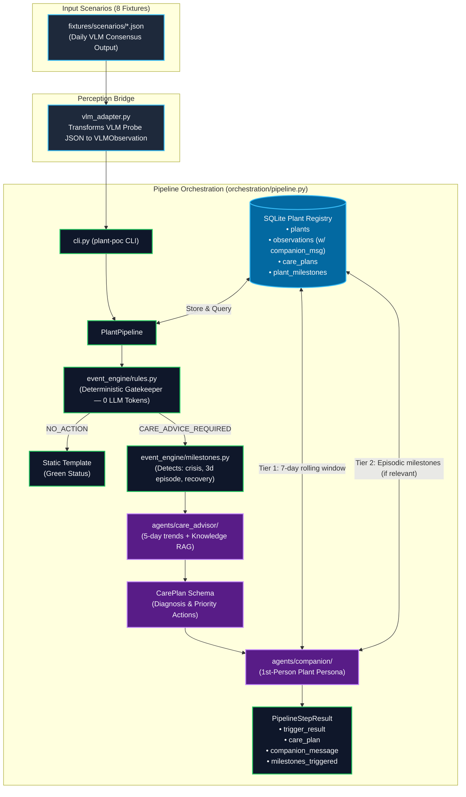

# Post-VLM Pipeline — Architecture & Scenario Trace

## Architecture Diagram



---

# File-by-File Execution Trace — All 8 Scenarios

This document traces **exactly** which file is called, in what order, with what data — for every scenario. Think of it as a manual debugger you can follow line-by-line.

---

## Entry Point (every scenario)

**Step 0: You type the command**

```bash
uv run plant-poc run-batch --scenario new_symptom
```

**→ File: `src/plant_poc/cli.py`**

`main()` is called. `argparse` parses `run-batch --scenario new_symptom`.
It calls `cmd_run_batch(scenario_arg="new_symptom")`.

That function:
1. Reads `fixtures/scenarios/new_symptom.json`
2. Creates a `PlantPipeline` via `PlantPipeline.create_default()`
3. Calls `pipeline.run_scenario(observations)` with the list of `VLMObservation` objects
4. Loops through the returned results and prints each day's output

---

## Setup (every time a pipeline is created)

**→ File: `src/plant_poc/orchestration/pipeline.py` — `PlantPipeline.create_default()`**

This factory creates isolated, in-memory resources:

| What | File called | What it returns |
|------|-------------|-----------------|
| Empty plant registry DB | `registry/store.py → init_db(":memory:")` | SQLite connection (plants, observations, care_plans, plant_milestones) |
| Empty knowledge DB | `knowledge/store.py → init_knowledge_db(":memory:")` | SQLite connection (blank) |
| Knowledge ingestion | `knowledge/ingest.py → ingest_knowledge_directory(store)` | Reads `fixtures/knowledge/*.md`, embeds each file, stores chunks |
| Care Advisor Agent | `agents/care_advisor/agent.py → CareAdvisorAgent(llm, registry, retriever)` | Agent with 4 tools wired |
| Companion Agent | `agents/companion/agent.py → CompanionAgent()` | Voice & persona projector with two-tier memory |

After `create_default()` finishes, you have a fully wired, isolated pipeline.

---

## Scenario 1: `no_change.json` — Day 2 → `NO_ACTION`

```json
Day 1: health=healthy, conf=0.95, observations=[]
Day 2: health=healthy, conf=0.94, observations=[]
```

### Day 1
- `evaluate(Day1, None)` → Rule 3 fires: `NO_ACTION`.
- Saved to SQLite `observations`. Zero LLM calls.

### Day 2
- `evaluate(Day2, Day1)` → Rule 8 fires: `NO_ACTION`.
- Companion emits static steady template (0 tokens, < 1ms). Zero LLM calls.

---

## Scenario 2: `new_symptom.json` — Day 2 → `CARE_ADVICE_REQUIRED`

```json
Day 1: health=healthy, conf=0.92, observations=[]
Day 2: health=possibly_unhealthy, conf=0.90, observations=[{leaf_yellowing, severity:mild}]
```

### Day 1 → `NO_ACTION`

### Day 2
- `evaluate(Day2, Day1)` → Rule 4 fires: `POSSIBLY_UNHEALTHY` > `HEALTHY` → `CARE_ADVICE_REQUIRED`.
- Milestone engine detects `first_symptom` and records it to `plant_milestones`.
- Care Advisor runs RAG + history reasoning → outputs `CarePlan`.
- Companion Agent formats persona message with short-term history and saves to `observations.companion_message`.

---

## Scenario 3: `health_status_change.json` — Day 2 → `CARE_ADVICE_REQUIRED`

```json
Day 1: health=healthy, conf=0.95, observations=[]
Day 2: health=possibly_unhealthy, conf=0.88, observations=[{brown_edges, severity:mild}]
```

- Rule 4 fires: `POSSIBLY_UNHEALTHY` > `HEALTHY` → `CARE_ADVICE_REQUIRED`.
- Care Advisor queries Knowledge RAG for overwatering / brown edges.
- Companion speaks in plant's first-person voice.

---

## Scenario 4: `severity_increase.json` — Day 2 → `CARE_ADVICE_REQUIRED`

```json
Day 1: health=possibly_unhealthy, conf=0.88, observations=[{leaf_yellowing, severity:mild}]
Day 2: health=unhealthy, conf=0.91, observations=[{leaf_yellowing, severity:severe}]
```

- Rule 4 fires: `UNHEALTHY` > `POSSIBLY_UNHEALTHY`.
- Milestone engine records `health_crisis`.
- Care Advisor notes severity escalation and updates care priority.

---

## Scenario 5: `low_confidence.json` — Day 2 → `REQUEST_MORE_INFORMATION`

```json
Day 1: health=healthy, conf=0.90, observations=[]
Day 2: health=healthy, conf=0.35, observations=[]
```

- Rule 1 fires: `confidence 0.35 < 0.50` threshold.
- Pipeline short-circuits. Low-confidence observation is **not saved** to the DB.
- Fast static template informs owner to retake photo without consuming LLM tokens.

---

## Scenario 6: `improvement.json` — Day 2 → `NO_ACTION`

```json
Day 1: health=unhealthy, conf=0.92, observations=[{leaf_yellowing, severity:severe}]
Day 2: health=possibly_unhealthy, conf=0.91, observations=[{leaf_yellowing, severity:mild}]
```

- Rule 7 fires: `POSSIBLY_UNHEALTHY` < `UNHEALTHY` (health improved).
- `NO_ACTION` returned. Companion recognizes improvement and expresses gratitude.

---

## Scenario 7: `mixed_multiday.json` — 5-Day Progression

```json
Day 1: health=healthy (0.95)              → NO_ACTION
Day 2: health=possibly_unhealthy (0.90)   → CARE_ADVICE_REQUIRED
Day 3: health=unhealthy (0.92)            → CARE_ADVICE_REQUIRED
Day 4: health=possibly_unhealthy (0.89)   → NO_ACTION (improving)
Day 5: health=possibly_unhealthy (0.40)   → REQUEST_MORE_INFORMATION (low conf)
```

---

## Scenario 8: `milestone_lifecycle.json` — 6-Day Full Lifecycle

Exercises deterministic milestone tracking and two-tier memory over a complete life crisis:

| Day | Health Status | Symptoms | Trigger Decision | Milestone Triggered |
|---|---|---|---|---|
| 1 | `healthy` | None | `NO_ACTION` | None |
| 2 | `possibly_unhealthy` | `leaf_yellowing:mild` | `CARE_ADVICE_REQUIRED` | `first_symptom` |
| 3 | `unhealthy` | `brown_spots:severe` | `CARE_ADVICE_REQUIRED` | `health_crisis` |
| 4 | `unhealthy` | `brown_spots:severe` | `NO_ACTION` (stable sick) | None (streak day 2) |
| 5 | `unhealthy` | `brown_spots:severe` | `NO_ACTION` (stable sick) | `severe_episode` (streak day 3) |
| 6 | `healthy` | None | `NO_ACTION` (recovered) | `full_recovery` |

---

## Key Files Summary (Quick Reference)

| File | Role | Called when |
|------|------|-------------|
| `src/plant_poc/cli.py` | CLI entry point, loads fixture JSON, prints results | Always first |
| `src/plant_poc/config.py` | Constants: Ollama URL, threshold=0.50, fixture paths | On import everywhere |
| `src/plant_poc/schemas/` | Pydantic data contracts (VLMObservation, PlantMilestone, CarePlan) | When loading/validating data |
| `src/plant_poc/vlm_adapter.py` | Transforms 5-pass consensus PROBE RESULT into VLMObservation | When processing VLM probe output |
| `src/plant_poc/orchestration/pipeline.py` | Coordinates Event Engine, milestones, Care Advisor & Companion | Daily per scenario |
| `src/plant_poc/registry/store.py` | Creates SQLite tables (plants, observations, care_plans, plant_milestones) | During `init_db()` |
| `src/plant_poc/registry/repository.py` | Read/write observations, profiles, care plans, milestones | Every day |
| `src/plant_poc/event_engine/rules.py` | 8-rule deterministic triage, zero LLM | Every day |
| `src/plant_poc/event_engine/milestones.py` | Deterministic life event detection (crisis, 3-day severe episode, recovery) | Every clean scan |
| `src/plant_poc/knowledge/ingest.py` | Reads `.md` → embeds → stores | Once at setup |
| `src/plant_poc/knowledge/embeddings.py` | Vectors via Ollama (`nomic-embed-text`) or hash fallback | Ingest + RAG query |
| `src/plant_poc/knowledge/store.py` | SQLite CRUD for knowledge chunks | Ingest + retrieval |
| `src/plant_poc/knowledge/retriever.py` | Cosine similarity + topic boost → top-K chunks | When `search_plant_knowledge` is called |
| `src/plant_poc/llm/base.py` | `LLMClient` protocol + `MockLLMClient` | When agent sends LLM request |
| `src/plant_poc/llm/ollama_client.py` | HTTP POST to Ollama `/api/chat` | When live LLM inference is needed |
| `src/plant_poc/agents/base.py` | Tool-calling loop, JSON extraction, retry logic | Care Advisor reasoning |
| `src/plant_poc/agents/care_advisor/agent.py` | Drives botanical care advice flow | When `CARE_ADVICE_REQUIRED` |
| `src/plant_poc/agents/companion/prompts.py` | Two-tier memory prompts (7-day history + conditional milestones) | Before Companion message generation |
| `src/plant_poc/agents/companion/agent.py` | Persona plant-voice projector with two-tier memory context | Every day |

---

## Decision Rule Order (Event Engine — quick cheat sheet)

```text
evaluate(new, previous):
  Rule 1: new.confidence < 0.50                    → REQUEST_MORE_INFORMATION  (exits)
  Rule 2: any symptom.confidence < 0.50            → REQUEST_MORE_INFORMATION  (exits)
  Rule 3: previous is None:
          healthy + no symptoms                     → NO_ACTION                 (exits)
          else                                      → CARE_ADVICE_REQUIRED      (exits)
  Rule 4: health_rank(new) > health_rank(previous) → CARE_ADVICE_REQUIRED      (exits)
  Rule 5: new symptom TYPE not in previous         → CARE_ADVICE_REQUIRED      (exits)
  Rule 6: same TYPE but severity_rank increased    → CARE_ADVICE_REQUIRED      (exits)
  Rule 7: health_rank(new) < health_rank(previous) → NO_ACTION                 (exits)
  Rule 8: DEFAULT                                  → NO_ACTION
```
